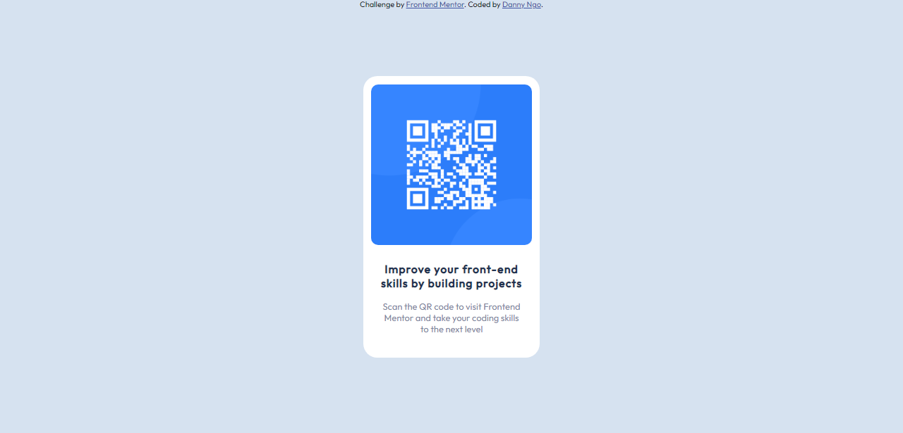

# Frontend Mentor - QR code component solution

This is a solution to the [QR code component challenge on Frontend Mentor](https://www.frontendmentor.io/challenges/qr-code-component-iux_sIO_H). 

## Table of contents

- [Overview](#overview)
  - [Screenshot](#screenshot)
  - [Links](#links)
- [My process](#my-process)
  - [Built with](#built-with)
- [Author](#author)

**Note: Delete this note and update the table of contents based on what sections you keep.**

## Overview

### Screenshot

### Links

- Solution URL: [Solution Repo here](https://github.com/Dang-n/Frontend-developing-projs/tree/main/QR-code-component-project)
- Live Site URL: [Live site demo here](https://frontend-developing-projs.vercel.app/)

## My process

### Built with

- CSS custom properties
- Flexbox

## Author

- Website - [Danny Ngo](https://www.your-site.com)
- Frontend Mentor - [@Dang-n](https://www.frontendmentor.io/profile/Dang-n)

